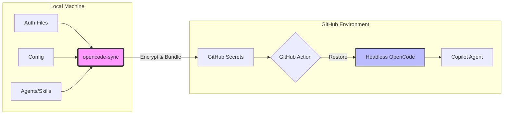
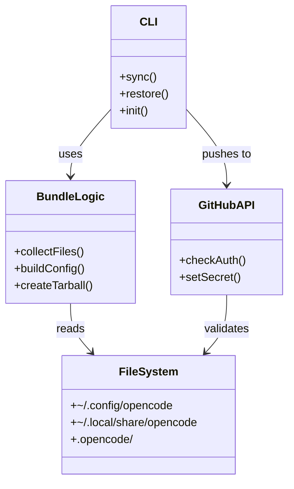

# OpenCode Sync

Sync your local OpenCode authentication and configuration to GitHub secrets for use in GitHub Copilot agents and CI workflows.

This tool is the "missing link" that enables [OpenCode GitHub Integration](https://opencode.ai/docs/github/) to work in headless environments like GitHub Actions or Copilot Agents.

## How It Works



## Features

- 🔒 **Securely Syncs Auth**: Bundles your local Antigravity OAuth tokens and session state.
- ⚙️ **Configurable Sync**: Choose what to sync (full config, merged config, or auth only).
- 🧩 **Selective Merging**: Override models, add plugins, or merge specific provider settings for remote environments.
- 🤖 **Zero-Boilerplate CI**: Includes a reusable GitHub Action for one-line setup in workflows.
- 🛡️ **Secret Protection**: Pre-commit hooks prevent accidental committing of auth files.

## Usage

### 1. Initialize

In your project root:

```bash
bunx opencode-sync init
```

### 2. Configure

Edit `.opencode/opencode-sync.jsonc`.

<details>
<summary><b>View Example Configuration</b></summary>

```jsonc
{
  "defaults": {
    "environment": "copilot",
    "secretName": "OPENCODE_AUTH_BUNDLE",
    "sync": {
      "auth": { "antigravity-accounts": true, "auth": true },
      // Sync entire directories
      "opencodeConfigDir": false, 
      "opencodeDataDir": false,
      
      "config": {
        "mode": "merge",
        "model": "google/antigravity-gemini-3-flash",
        "plugins": ["opencode-antigravity-auth@1.2.8", "@opencode-ai/github"]
      },
      
      // Generic file syncing
      "include": [
        // Sync specific files
        "my-custom-prompt.md",
        // Sync with rename
        { "source": "local/path.json", "dest": "remote/path.json" }
      ]
    }
  },
  "targets": {
    "prod": { "repo": "myuser/my-repo" }
  }
}
```
</details>

### 3. Sync

Push your local auth to the repo's secret:

```bash
bunx opencode-sync sync
```

### 4. Use in CI

In your GitHub Workflow:

<details>
<summary><b>View Workflow Example</b></summary>

```yaml
jobs:
  agent:
    runs-on: ubuntu-latest
    environment: copilot
    steps:
      - uses: actions/checkout@v4
      - uses: oven-sh/setup-bun@v1
      
      # Restore auth & install opencode
      - uses: myuser/opencode-sync@v1
        with:
          bundle: ${{ secrets.OPENCODE_AUTH_BUNDLE }}
          
      # Run agent via command
      - run: opencode run --command "manage-issues" "Analyze this PR"
```
</details>

## Example Workflows

### GitHub Copilot Agent + OpenCode

Let GitHub Copilot's coding agent use OpenCode with real Antigravity models for investigating functionality, running tests, and developing features.

See [`examples/copilot-setup-steps.yml`](examples/copilot-setup-steps.yml) - copy to `.github/workflows/copilot-setup-steps.yml`

### @opencode Mention Handler

Trigger an OpenCode agent by mentioning `@opencode` in any issue or PR comment. The agent receives full context (issue body, comment thread, PR diff) and can investigate, fix, or respond.

See [`examples/opencode-mention.yml`](examples/opencode-mention.yml) - copy to `.github/workflows/opencode-mention.yml`

**Example usage:**
```
@opencode investigate why the tests are failing and fix it
@opencode review this PR and suggest improvements  
@opencode add error handling to the auth module
```

---

## Architecture



### Key Components
- [src/cli.ts](src/cli.ts): Main entry point using Optique.
- [src/bundle.ts](src/bundle.ts): Core logic for collecting files and creating secure bundles.
- [src/config.ts](src/config.ts): Configuration resolution and merging.
- [src/github.ts](src/github.ts): GitHub CLI integration.

---

## For Agents

<details>
<summary><b>🤖 Setup Instructions for AI Agents</b></summary>

If you are an agent setting up `opencode-sync` for a user in a new project, follow these steps:

1.  **Install**:
    ```bash
    bun add -d opencode-sync
    ```

2.  **Initialize**:
    ```bash
    bun run opencode-sync init
    ```

3.  **Configure**:
    - Read `.opencode/opencode-sync.jsonc`.
    - Update `repo` to match the current repository (use `gh repo view --json nameWithOwner -q .nameWithOwner`).
    - Ensure `plugins` includes `@opencode-ai/github`.

4.  **Sync**:
    ```bash
    bun run opencode-sync sync
    ```

5.  **Create Workflow**:
    - Ensure `.github/workflows/opencode-agent.yml` exists and uses the `OPENCODE_AUTH_BUNDLE` secret.
</details>

---

## Resources

- **Creator**: [Nick Roth](https://www.nickroth.com)
- **OpenCode**: [GitHub](https://github.com/opencode-ai) | [Website](https://opencode.ai)
  - [Agents Docs](https://opencode.ai/docs/agents/)
  - [Skills Docs](https://opencode.ai/docs/skills/)
  - [GitHub Plugin](https://opencode.ai/docs/github/)

## License

MIT
